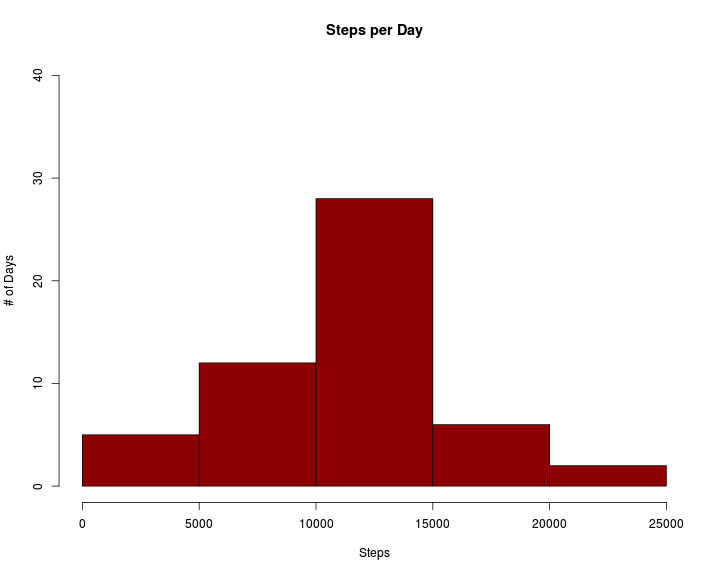
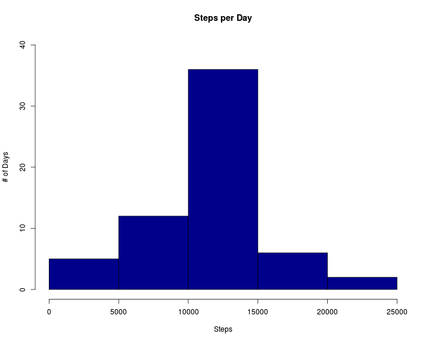
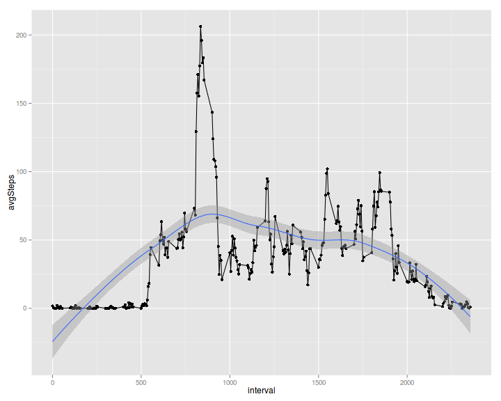
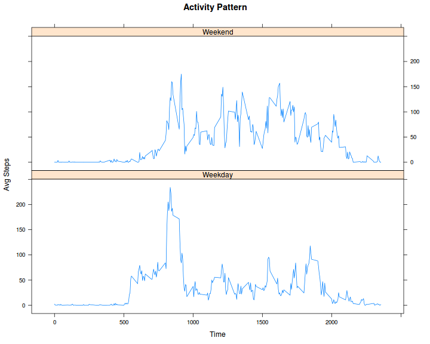
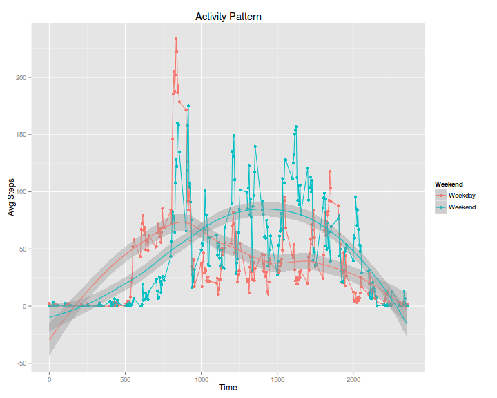

This assignment makes use of the following packages:  
 - ggplot2: For plots  
 - Hmisc: For Imput  
 - plyr: Pre-processing data  
 - dplyr: Pre-processing data  

## Loading and preprocessing
** Load the data **

```r
dat<-read.csv("activity.csv",colClasses="character")
```

** Process/transform the data **

```r
dat$interval<-as.numeric(dat$interval)
dat$date<-as.Date(dat$date)
dat$steps<-as.numeric(dat$steps)

# Convert interval to a more readable format
dat$time<-sapply(
  dat$interval,
  function(x) {
    H<-x%/%100 ;
    M<-x%%100 ;
    H<-sprintf("%02d", H) ;
    M<-sprintf("%02d", M) ;
    paste(c(H, ':', M), collapse='')
    }
  )

# Remove entries with NA
dat1<-dat[!is.na(dat$steps),]
```

## Steps per Day
** Make a histogram of the total number of steps taken each day **

```r
dat1<-group_by(dat1, date)
stepsDay<-summarise(dat1, totSteps=sum(steps))
hist(
  stepsDay$totSteps, 
  col="dark red", 
  xlab="Steps",
  ylab="# of Days",
  main="Steps per Day",
  breaks=seq(0,25000,5000), 
  xlim=c(0,25000), 
  ylim=c(0, 40)
  )
```

 

** Calculate and report the mean and median total number of steps taken per day **

```r
mean(stepsDay$totSteps)
```

```
## [1] 10766.19
```

```r
median(stepsDay$totSteps)
```

```
## [1] 10765
```


## Daily Activity Pattern
** Make a time series plot of the 5-minute interval and the average number of steps taken across all days **

```r
dat1<-group_by(dat1, interval)
activityDay<-summarise(dat1, avgSteps=mean(steps))
plot(
  x=activityDay$interval, 
  y=activityDay$avgSteps, 
  type='l',
  xlab="Time",
  ylab="Steps",
  main="Activity Pattern",
  xlim=c(0,2400)
  )
```

 

** Which 5-minute interval, on average across all the days in the dataset, contains the maximum number of steps? **

```r
activityDay$interval[which.max(activityDay$avgSteps)]
```

```
## [1] 835
```


## Imputing missing values
** Calculate and report the total number of missing values in the dataset (i.e. the total number of rows with NAs) **

```r
sum(!complete.cases(dat))
```

```
## [1] 2304
```

** Fill in all missing values using mean of interval taken over all days **  
** Create a new dataset that is equal to the original dataset but with the missing data filled in. **

```r
datI <- ddply(dat, ~ interval, transform, steps = impute(steps, fun=mean))
datI <- datI[order(datI$date), ]
datI$steps <- round(as.numeric(datI$steps))
```

** Make a histogram of the total number of steps taken each day  **

```r
datI<-group_by(datI, date)
stepsDay<-summarise(datI, totSteps=sum(steps))
hist(
  stepsDay$totSteps, 
  col="dark blue", 
  xlab="Steps",
  ylab="# of Days",
  main="Steps per Day",
  breaks=seq(0,25000,5000), 
  xlim=c(0,25000), 
  ylim=c(0, 40)
  )
```

 

```r
datI<-group_by(datI, interval)
activityDayI<-summarise(datI, avgSteps=mean(steps))
qplot(interval, avgSteps, data=activityDayI)+geom_line()+geom_smooth(method=loess)
```

 

** Calculate and report the mean and median total number of steps taken per day **

```r
mean(stepsDay$totSteps)
```

```
## [1] 10765.64
```

```r
median(stepsDay$totSteps)
```

```
## [1] 10762
```
Mean and median calculated with the Imputed data is slightly different from the original values.
This is because most of the data missing are corresponding to intervals where there is less activity.
So the imputed data in these intervals bring down the overall mean and median.


## Weekdays vs Weekends
** Create a new factor variable 'Weekend' **

```r
dat1$Weekday<-weekdays(dat1$date)
dat1$Weekend<-ifelse((dat1$Weekday == "Saturday") | (dat1$Weekday == "Sunday"), "Weekend", "Weekday")
```


** Make a panel plot containing a time series plot of the 5-minute interval and the average number of steps **

```r
dat1<-group_by(dat1, Weekend, interval)
activityWeekend<-summarise(dat1, avgSteps=mean(steps))
xyplot(
  avgSteps~interval | Weekend, 
  data=activityWeekend, 
  layout=c(1,2), 
  type='l',
  xlab="Time",
  ylab="Avg Steps",
  main="Activity Pattern"
  )
```

 

```r
p <- qplot(
  interval,
  avgSteps, 
  color=Weekend, 
  data=activityWeekend,
  xlab="Time",
  ylab="Avg Steps",
  main="Activity Pattern"
  ) 
p <- p + geom_line() 
p <- p + geom_smooth(method=loess)
plot(p)
```

 

On weekdays, the activity is mainly in the morning around 8:30am.  
However on the weekends, activity is more distributed during daytime and evening.
